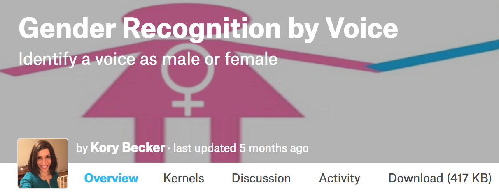

# 语音性别识别

## 描述

使用机器学习的方法判断一段音频信号是男性还是女性。

## 数据

这个数据集包含3168个样本，其中50%为男性，50%为女性。我们已经从音频信号中提取出特征，你无需了解任何音频信号处理的知识。如果你对音频信号处理感兴趣，你可以通过下面的链接了解每一个特征的含义。

此数据集可以从[kaggle](https://www.kaggle.com/primaryobjects/voicegender)下载。

- meanfreq: 频率平均值 (in kHz)
- sd: 频率标准差
- median: 频率中位数 (in kHz)
- Q25: 频率第一四分位数 (in kHz)
- Q75: 频率第三四分位数 (in kHz)
- IQR: 频率四分位数间距 (in kHz)
- skew: [频谱偏度](https://en.wikipedia.org/wiki/Skewness)
- kurt: [频谱峰度](https://en.wikipedia.org/wiki/Kurtosis)
- sp.ent: 频谱熵
- sfm: [频谱平坦度](https://en.wikipedia.org/wiki/Spectral_flatness)
- mode: 频率众数
- centroid: [频谱质心](https://en.wikipedia.org/wiki/Spectral_centroid)
- peakf: 峰值频率
- meanfun: 平均基音频率
- minfun: 最小基音频率
- maxfun: 最大基音频率
- meandom: 平均主频
- mindom: 最小主频
- maxdom: 最大主频
- dfrange: 主频范围
- modindx: 累积相邻两帧绝对基频频差除以频率范围
- label: 男性或者女性

## 建议

推荐使用的模型：
- 逻辑回归
- 决策树
- 随机森林
- 支持向量机
- 神经网络
- XGBoost

## 值得关注的问题
下面是一些问题，你可以用上面的数据集来回答。你也可以自由发挥，我们也鼓励你基于数据集开发你自己感兴趣的问题；这些只是让你如何开始。

- 那些特征对于区分男性和女性很重要？
- 从生活中采集6段语音，模型能够正确的识别吗？你需要阅读[feature.md](feature.md)，了解如何运行R语言的脚本来提取特征。
- 对于那些不能正确识别的样本，能够分析一下原因吗？
- 类似的方法，可以用于识别语音的年龄区间吗？
- 在数据集中，我们已经基于经验计算出了一些有价值的特征，是否能够跳过特征提取的步骤，使用诸如神经网络的模型直接对音频信号进行识别？

## 应用（可选）

应用形式多种多样，可以是在本地调用麦克风运行的程序，也可以网页的，也可以是 iOS APP 或 Android APP，甚至可以是微信公众号。

你可以参考下面这个网页应用来设计自己的应用。

http://voice-primaryobjects.rhcloud.com/

## 相关资料

一个使用R语言分析数据集的例子：

- [Identifying the Gender of a Voice using Machine Learning](http://www.primaryobjects.com/2016/06/22/identifying-the-gender-of-a-voice-using-machine-learning/)

如果你想从原始音频中来提取特征，可以从下面的地址获取原始音频文件：

- [The Harvard-Haskins Database of Regularly-Timed Speech](http://www.nsi.edu/~ani/download.html)
- [Telecommunications & Signal Processing Laboratory (TSP) Speech Database at McGill University](http://www-mmsp.ece.mcgill.ca/Documents/Downloads/TSPspeech/TSPspeech.pdf), [Home](http://www-mmsp.ece.mcgill.ca/Documents/Data/index.html)
- [VoxForge Speech Corpus](http://www.repository.voxforge1.org/downloads/SpeechCorpus/Trunk/Audio/Main/8kHz_16bit/), [Home](http://www.voxforge.org)
- [Festvox CMU_ARCTIC Speech Database at Carnegie Mellon University](http://festvox.org/cmu_arctic/)

## 评估

你的项目会由优达学城项目评审师依照[机器学习毕业项目要求](https://review.udacity.com/#!/rubrics/273/view)来评审。请确定你已完整的读过了这个要求，并在提交前对照检查过了你的项目。提交项目必须满足所有要求中每一项才能算作项目通过。

## 提交

* PDF 报告文件
* 数据预处理代码（建议使用 jupyter notebook ）
* 模型训练代码（建议使用 jupyter notebook ）
* 应用代码（可选）
* 包含使用的库，机器硬件，机器操作系统，训练时间等数据的 README 文档（建议使用 Markdown ）
