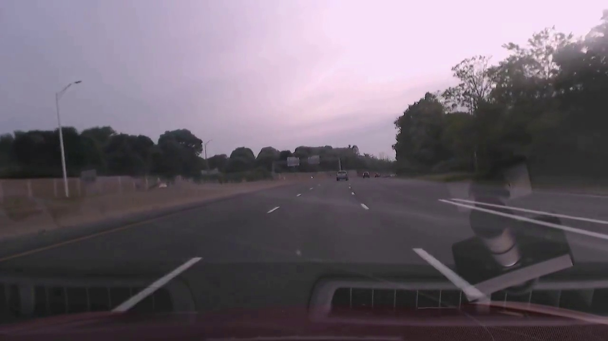

# Deep Learning for Self-Driving Cars : DeepTesla
http://selfdrivingcars.mit.edu/deeptesla/
  
## 题目描述
本项目中，你需要利用MIT 6.S094 这门公开课中的Tesla数据集训练深度学习模型，根据车辆的前置相机所拍摄的路况图像，实现对车辆转向角度的预测。

## 数据
主要包括tesla在两种不同驾驶模式（human driving和autopilot）下的前置相机录制的视频和车辆的转向控制信号。数据可以从这里下载:[百度云](https://pan.baidu.com/s/1c2J2IFA)

数据格式如下:
  
  - 前置相机记录的视频: 截图如下
    
    

 
- 行驶过程中的控制信号: CSV格式

    ts_micro         | frame_index | wheel 
    ------------------|-------------|-------
      1464305394391807 | 0           | -0.5  
      1464305394425141 | 1           | -0.5  
      1464305394458474 | 2           | -0.5  

其中，`ts_micro`是时间戳，`frame_index`是帧编号，`wheel`是转向角度（以水平方向为基准，+为顺时针，-为逆时针）

## 建议
* [课程讲义](https://www.dropbox.com/s/q34bi7t0udms01x/lecture3.pdf?dl=1)提供了很好的入门介绍，原链接在dropbox，国内用户可以从[百度云](https://pan.baidu.com/s/1slmfBLb)下载。
* [课程项目介绍](http://selfdrivingcars.mit.edu/deeptesla/)阐述了实现思路(ConvNetJS)。
* [课程网页应用](http://selfdrivingcars.mit.edu/deepteslajs/)提供了试验环境，可以测试模型的效果。
* 除了课程介绍之外的几个有用的课程和论文:
    - [End to End Learning for Self-Driving Cars](https://images.nvidia.com/content/tegra/automotive/images/2016/solutions/pdf/end-to-end-dl-using-px.pdf)
    - [Dataset and code for 2016 paper "Learning a Driving Simulator" ](https://github.com/commaai/research/blob/master/train_steering_model.py)
    - [CS231n Convolutional Neural Networks for Visual Recognition](http://cs231n.github.io/neural-networks-1/)

* 我们建议将你的网络输入课程所提供的[网页应用](http://selfdrivingcars.mit.edu/deepteslajs/)中，利用ConvNetJS来测试、查看模型的预测效果(并不必须)，关于ConvNetJS的资料，可以参考[karpathy/convnetjs/](http://cs.stanford.edu/people/karpathy/convnetjs/)。

## 要求
* 本项目要求使用python3 + keras + tensorflow + jupyter notebook来完成。项目目录如下图所示

    - epochs/ 这里包含训练所需的视频和转向信号（无需修改）
    - images/ 这里包含生成结果视频所需的媒体文件（无需修改）
    - models/ 这里应包含训练好的模型，包括model.json和model.h5
    - output/ 这里应包含模型在`epoch10_front.mkv`上的表现效果
    
    - utils.py 这里包含读取模型、生成视频等函数（无需修改）
    - params.py 这里包含一些默认设置（根据喜好修改，建议不修改）
    - run.py 这里包含生成结果视频的主程序，其中对图像的预处理函数`img_pre_process()`，应根据需求修改；其他部分无需修改。
    
    

* 优化你的模型并使预测结果和真实的转向角度尽可能接近。这里我们以`epoch10_front.mkv`对应的行驶记录作为评价标准，你的报告中应该包含模型最后在该记录中取得的效果。

* 当训练好你的网络后，请按如下步骤生成最终结果： 
    - 查看params.py，根据你的喜好更改模型、数据的存储位置。（我们建议命名及位置等保持默认设置，以下的讲解全部按照params.py中的默认设置进行）
    - 用keras导出你的训练模型和参数，分别命名为model.json和model.h5，放置于`./models`文件夹下。具体导出方法见：
        - https://keras.io/models/about-keras-models/
        - http://keras-cn.readthedocs.io/en/latest/getting_started/FAQ/
    - 在deeptesla的根目录下运行python run.py，运行时会询问你是否采用`./models`中已有的模型，选择`y`
    - 接下来程序会输出模型的描述，并根据你的模型生成`epoch10_front.mkv`的结果视频并保存在`./output`中，我们对你模型的评价将参考这一视频的结果。结果视频如题目描述中的动图所示。

## 评估
你的项目会由优达学城项目评审师依照[机器学习毕业项目要求](https://review.udacity.com/#!/rubrics/273/view)来评审。请确定你已完整的读过了这个要求，并在提交前对照检查过了你的项目。提交项目必须满足所有要求中每一项才能算作项目通过。
                                
                                
## 提交：
* PDF 报告文件（注意这不应该是notebook的导出，请尽量按照[模板](https://github.com/nd009/capstone/blob/master/capstone_report_template.md)填写）

* `./output`中生成的视频`epoch10_human_machine.mp4`

* 项目相关代码（包括从raw data开始到最终结果以及你过程中所有数据分析和作图的代码，其中分析和可视化部分建议在notebook中完成）

* 包含使用的库，机器硬件，机器操作系统，训练时间等数据的 README 文档（建议使用 Markdown ）
