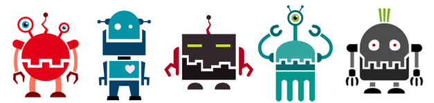

# Facebook Recruiting IV: Human or Robot?
https://www.kaggle.com/c/facebook-recruiting-iv-human-or-bot/data

## 题目描述：
你需要根据提供的拍卖数据，识别出混在正常用户中的机器人用户
## 数据：
主要包括投标者的信息和投标的信息；具体介绍可以看[这里](https://www.kaggle.com/c/facebook-recruiting-iv-human-or-bot/data)
## 建议：
* 这有份很好的关于kaggle的[资料](https://www.ke.tu-darmstadt.de/lehre/arbeiten/studien/2015/Dong_Ying.pdf)
* 除了课程介绍之外的几个有用的库
> * 可视化 [seaborn](http://seaborn.pydata.org/)
> * 高效的boosting模型[xgboost](https://github.com/dmlc/xgboost)
> * MSRA的boosting实现[lightGBM](https://github.com/Microsoft/LightGBM)

* 你提交之后会有在private board上的得分，请截图提供在你的报告中
* 如果你使用[kernel](https://www.kaggle.com/kernels)（请注意它有资源限制，所以不一定能够运行完成你的模型）来运行代码，请提供链接。
## 评估
你的项目会由优达学城项目评审师依照[机器学习毕业项目要求](https://review.udacity.com/#!/rubrics/273/view)来评审。请确定你已完整的读过了这个要求，并在提交前对照检查过了你的项目。提交项目必须满足所有要求中每一项才能算作项目通过。

## 提交
* PDF 报告文件（注意这不应该是notebook的导出，请尽量按照[模板](https://github.com/nd009/machine-learning/blob/zh-cn/projects/capstone/capstone_report_template.md)填写）
* 项目相关代码（包括从raw data开始到最终结果以及你过程中所有数据分析和作图的代码，其中分析和可视化部分建议在notebook中完成）
* 包含使用的库，机器硬件，机器操作系统，训练时间等数据的 README 文档（建议使用 Markdown ）
